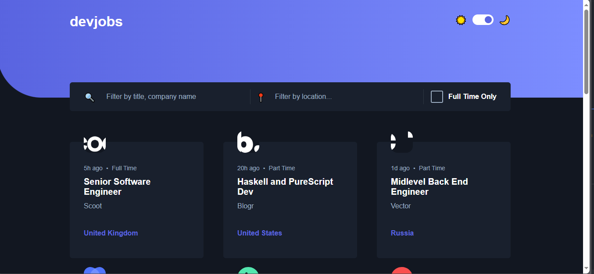
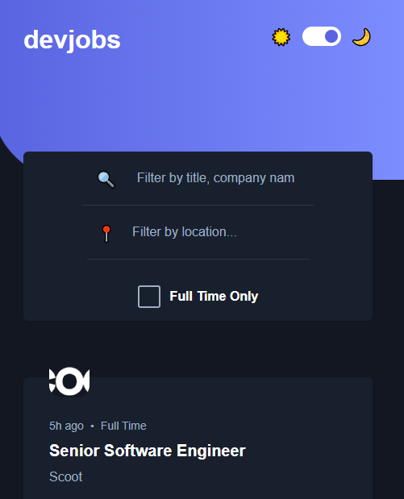

# 🌟 Job Offers Website (React.js)

This is a **React.js web application** for browsing job offers with support for **dark and light themes**. The project is currently in development. 🚀

## 🚀 Features (Planned & Implemented)

✅ **Built with React.js** ⚛️  
✅ **Dark & Light Mode Toggle** 🌗  
✅ Fetches **job listings** dynamically 🏢  
✅ Displays job details, including:
   - Company Name 🏢  
   - Job Title 📌  
   - Location 🌍  
   - Job Type (Full-time, Part-time, etc.) ⏳  
   - Salary 💰  
✅ **Search & Filtering** for job offers 🔍  
✅ **React Router** for navigation 🛤️  
✅ **Fully responsive design** 📱💻  

---

## 🛠️ Technologies Used

- **React.js** - Frontend framework  
- **React Router** - For navigation and dynamic routing  
- **Styled Components / CSS** - For styling with dark/light mode support  
- **Axios / Fetch API** - For fetching job data  

---

## 📸 Screenshots

### 🌙 Home Page (Desktop)


### 🏠 Home Page (Mobile)



## 🔧 Installation & Setup

1. **Clone the repository**  
   ```bash
   git clone https://github.com/yourusername/job-offers-website.git
   ```
2. **Navigate to the project directory**  
   ```bash
   cd job-offers-website
   ```
3. **Install dependencies**  
   ```bash
   npm install
   ```
4. **Run the development server**  
   ```bash
   npm start
   ```

---

## 🚀 Future Improvements

🔹 User authentication & profiles 👤  
🔹 Job application submission 📄  
🔹 Saved jobs & favorites ⭐  
🔹 Enhanced filtering & sorting options 🎯  

Stay tuned for updates! 🚀

